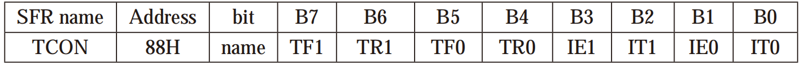
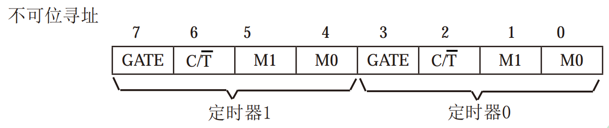
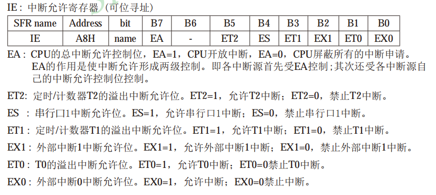
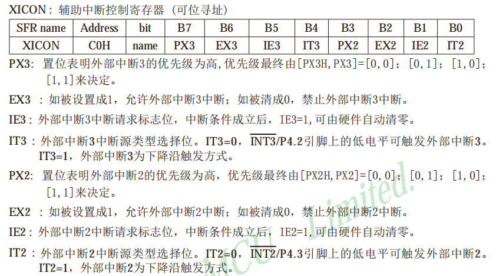
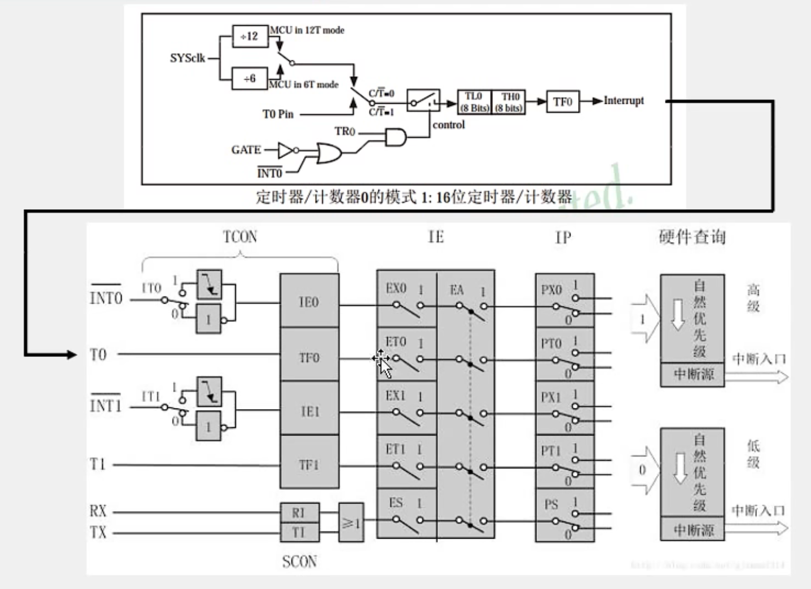

# Ubuntu
## 1.文件作用
* bin 所有用户都可以使用的、基本的命令
* boot 设备文件，比如内核等
* dev 设备文件，Linux特有的
* etc 配置文件
* home 家目录
	* hui 用户hui的家目录
* lib 库
* media 插上U盘等外设时会挂载到该目录下
* mnt 用来挂载其他文件系统
* opt optional 可选的程序
* proc 用来挂载其他文件系统，可以查看各进程（process）的信息
* root root用户的家目录
* sbin 基本的系统命令，系统管理员才可以用
* sys 用来挂载虚拟的sys文件系统，可以查看系统信息：比如设备信息
* tmp 临时目录，存放临时文件
* usr unix software Resource ，存放可分享的不可变动的数据
	* bin 绝大部分的用户可使用指令都放在这里（与开机无关），/bin中的命令与开机有关
	* games 游戏
	* include 头文件
	* lib 库
	* local 系统管理员在本机自行安装、下载的软件
	* sbin 非系统正常运作所需要的系统命令
	* share 放置共享文件的地方，比如/usr/share/man里存放帮助文件
	* src 源码
* var 主要针对常态性变动的文件，包括缓存（cache）、log文件等 
* /home/ 绝对路径     ./当前路径
* -rwxrwxr-x 1hui hui 16744 9月 5 11：18 hello

-（小横杠）表示常规文件文件（d开头则为目录文件），前三位表示自己的权限（可读可写可执行）之后三位表示同组权限（可读可写可执行）最后表示普通用户权限
* chmod 改变权限 每三位为一组通过二进制来表示 例如chmod 675
* 
# 通讯
##  I2C
一个主设备多个从设备
两条线
* SCL时钟线
* SDA数据线
## SPI
一个主设备多个从设备
四条线
* SS 片选信号线 确定从设备的选择
* SCK 时钟信号线
* MOSI 发送信号线 主设备发送数据，从设备接受数据
* MISO 接收信号线 主设备接收数据
## CAN
需要专门的CAN收发芯片，经常用于汽车工业中
## 定时器中断
* 操作定时器分为两个寄存器TCON（控制寄存器）和TMOD（工作模式寄存器）
### TCON控制寄存器（可位寻址--可分别操作寄存器每一位）

其中TF1、TF0为溢出标志，当计时器从初值开始计数时，当最高位数值溢出，TF1、TF0会被标记为1，表示溢出，请求外部中断

TR1、TR0为运行控制单位
* 当TMOD寄存器中的GATE位为0时，控制TR1、TR0为1，则该计时器开始计数
* 当TMOD寄存器中的GATE位为1时，TR1、TR0为1，且INT1、INT0输入高电平时，则该计时器开始计数

IE1、IE0为外部中断请求标志，当IE1、IE0值为1时，表示外部中断向CPU请求中断，当CPU响应该中断时，由硬件对IE1、IE0进行清0

### TMOD工作模式寄存器（不可位寻址--不可以分别操作寄存器每一位）

* GATE TMOD.7、TMOD.3控制位，当控制位为1时，只有INT1、INT0为高电平且TR1、TR0为1时，计时器/定时器打开

* C/T TMOD.6、TMOD.2控制定时器或计数器，当C/T位为1时是计数器、为0时是定时器

* TMOD中的M1、M0

|M1|M0|-|
|--|--|--
|0|0|13位定时器/计数器，兼容8048定时模式，TL1只用低五位参与分频  
|0|1|16位定时器/计数器，TL1、TH1全用
|1|0|8位自动重装载定时器，当溢出时将TH1存放的值自动重装入TL1
|1|1|定时器/计数器此时无效（停止计数）

寄存器高位TH0赋值65535/256

寄存器低位TL0赋值65535%256

将寄存器的高低位分开存储

~~~c
void Timer0_Init()
{
	TMOD = 0x01;//0000 0001
	TF0 = 0;
	TR0 = 1;
	TH0 = 65535/256;
	TL0 = 65535%256;
	ET0 = 1;
	EA = 1;
	PT0 = 0;
}
~~~