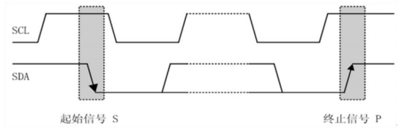

# Ubuntu
## 1.文件作用
* bin 所有用户都可以使用的、基本的命令
* boot 设备文件，比如内核等
* dev 设备文件，Linux特有的
* etc 配置文件
* home 家目录
	* hui 用户hui的家目录
* lib 库
* media 插上U盘等外设时会挂载到该目录下
* mnt 用来挂载其他文件系统
* opt optional 可选的程序
* proc 用来挂载其他文件系统，可以查看各进程（process）的信息
* root root用户的家目录
* sbin 基本的系统命令，系统管理员才可以用
* sys 用来挂载虚拟的sys文件系统，可以查看系统信息：比如设备信息
* tmp 临时目录，存放临时文件
* usr unix software Resource ，存放可分享的不可变动的数据
	* bin 绝大部分的用户可使用指令都放在这里（与开机无关），/bin中的命令与开机有关
	* games 游戏
	* include 头文件
	* lib 库
	* local 系统管理员在本机自行安装、下载的软件
	* sbin 非系统正常运作所需要的系统命令
	* share 放置共享文件的地方，比如/usr/share/man里存放帮助文件
	* src 源码
* var 主要针对常态性变动的文件，包括缓存（cache）、log文件等 
* /home/ 绝对路径     ./当前路径
* -rwxrwxr-x 1hui hui 16744 9月 5 11：18 hello

-（小横杠）表示常规文件文件（d开头则为目录文件），前三位表示自己的权限（可读可写可执行）之后三位表示同组权限（可读可写可执行）最后表示普通用户权限
* chmod 改变权限 每三位为一组通过二进制来表示 例如chmod 675
* 
# 通讯
## 串行通讯与并行通讯
### 串行通讯
使用一条数据线，将数据一位一位的进行传输，每一位数据占据一个固定的时间长度。其只需要少数几条线就可以在系统间交换信息，特别适用于计算机与计算机，计算机与外设之间的远距离通信，先传输低位在传输高位。


串行通信的特点：传输线少，长距离传送时成本低，且可以利用电话网等现成的设备，但数据的传送控制比并行通信复杂。
### 并行通讯
 并行通信通常是将数据字节的各位用多条数据线同时进行传送，通常是8位，16位，32位等数据一起传输。
 

 并行通信的特点：控制简单，传输速度快；由于传输线较多，长距离传送时成本高且接收方的各位同时接受存在困难，抗干扰能力差。打印机一般用并行通讯。
## 异步通信与同步通信
### 异步通信
异步通信是指通信的发送与接受设备适用各自的时钟控制数据的发送和接收过程。为使双方的收发协调，要求发送和接收设备的时钟尽可能一致。
异步通信是以字符（构成的帧）为单位进行传输，字符与字符之间的间隙（时间间隔）是任意的，但每个字符中的各位是以固定的时间传送的，即字符之间不一定有“位间隔”的整数倍的关系，但同一字符的各位之间的距离均为“位间隔”的整数倍。


异步通信的特点：不要求收发双方时钟的严格一致，实现容易，设备开销较小，但每个字符要附加2~3位用于起止位，各帧之间还有间隔，因此传输效率不高。
### 同步通讯
同步通信时要建立发送方时钟对接收方时钟的直接控制，使双方达到完全同步。此时，传输数据的位之间的距离均为“位间隔”的整数倍，同时传送的字符间不留间隙，即保持位同步关系，也保持字符同步关系。发送方对接收方的同步可以通过两种方法实现。


## 单工，半双工与全双工通信
|串口|功能|
|--|--|
|单工通讯|只能接受或只能发送|
|半双工通讯|即可接收又可发送，但不能同时进行|
|全双工通讯|能同时接收和发送|
## 通信速率
衡量通信性能的一个非常重要的参数就是通信速率，通常以**比特率**（Bitrate）来表示。比特率是每秒钟传输二进制代码的位数，单位是：位/秒（bps）.如每秒钟传送240个字符，而每个字符格式包含10位（1个起始位，1个停止位，8个数据位）这时的比特率为：10位×240个/秒=2400 bps。

后面会一段一个“‘**波特率**’”的概念，它表示每秒传输了多少个码元。而码元是通信信号调制的概念，通信常用时间间隔相同的符号来表示一个二进制数字，这样的信号成为码元。如常见的通信传输中，用 0V 表示数字 0, 5V 表述数字 1 ，那么一个码元可以表示两种状态 0 和 1，所以一个码元等于一个二进制比特位，此时波特率的大小与比特率一致；如果在通信传输中，有 0V，2V，4V 以及 6V分别表示二进制数 00,01,10,11 那么每个码元可以表示四种状态，即两个二进制比特位，所以码元数是二进制比特位数的一半，这个时候的波特率为比特率的一半 。由于很多常见的通信中一个码元都是表示两种状态，所以我们常常直接以波特率来表示比特率   
## 通讯协议
RS232的通信协议比较简单，通常遵循 **96-N-8-1** 格式。
“96”表示的是通信波特率为9600。串口通信中通常适用的是异步串口通信，即没有时钟线，所以两个设备要通信，必须要保持一直的波特率，当然，比特率常用值还有4800 115200 等。

“N”表示的是无校验位，由于串口通信相对更容易受到外部干扰导致传输数据出现偏差,可以在传输过程加上校验位来解决这个问题。校验方法有奇校验 (odd)、偶校验(even)、0 校验(space)、1 校验(mark)以及无校验(noparity)。 具体的介绍，大家可以百度串口通信了解。

“8”表示的是数据位数为 8 位，其数据格式在前面介绍异步通信中已讲过。当然数据位数还可以为 5、6、7 位长度。

“1”表示的是 1 位停止位，串口通讯的一个数据包从起始信号开始，直到停止信号结束。数据包的起始信号由一个逻辑 0 的数据位表示，而数据包的停止信号可由0.5、1、1.5 或 2 个逻辑 1 的数据位表示，只要双方约定一致即可。
## 电瓶标准

* TTL（晶体管逻辑电平）：+5V表示1，0V表示0
* RS232电平：-3~ -15V表示1，+3 ~ +15V表示0
* RS485电平：两线压差+2~ +6V表示1，-2~-6V表示0（差分信号）
##  I2C
一个主设备多个从设备
两条线
* SCL时钟线
* SDA数据线
  
具有三种传输模式：标准模式传输速率为100kbit/s，快速模式为400kbit/s，高速模式下可达3.4Mbit/s，但目前大多数设备尚不支持高速模式。

连接到相同总线的IC数量受到总线的最大电容400pF限制。

* 主机：启动数据传输并产生时钟信号的设备；
* 从机：被主机寻址的器件；
* 多主机：同时有多于一个主机尝试控制总线但不破坏传输；
* 主模式：用I2CNDAT支持自动字节计数的模式；位I2CRM,I2CSTT,I2CSTP控制数据的接收和发送；
* 从模式：发送和接收操作都是由I2C模块自动控制的；
* 仲裁：是一个在有多个主机同时尝试控制总线但只允许其中一个控制总线并使传输不被破坏的过程；
* 同步：两个或多个器件同步时钟信号的过程；
* 发送器：发送数据到总线的器件；
* 接收器：从总线接收数据的器件；

### I2C协议 
1. 数据有效性规定

	I2C总线在进行数据传输时，时钟信号为高电平期间，数据线上的数据必须保持稳定，只有在时钟线上的信号为低电平期间，数据线上的高电平或低电平状态才允许变化。每次数据传输都以字节为单位，每次传输的字节数不受限制。
	

2. 起始和停止信号
	
	SCL 线为高电平期间，SDA 线由高电平向低电平的变化表示起始信号；SCL
	线为高电平期间，SDA 线由低电平向高电平的变化表示终止信号。起始和终止信号都是由主机发出的，在起始信号产生后，总线就处于被占用
	的状态；在终止信号产生后，总线就处于空闲状态。
	

3. 应答响应
	
	每当发送器件传输完一个字节的数据后，后面必须紧跟一个校验位，这个校
验位是接收端通过控制 SDA（数据线）来实现的，以提醒发送端数据我这边已经
接收完成，数据传送可以继续进行。这个校验位其实就是数据或地址传输过程中
的响应。响应包括“应答(ACK)”和“非应答(NACK)”两种信号。作为数据接收
端时，当设备(无论主从机)接收到 I2C 传输的一个字节数据或地址后，若希望
对方继续发送数据，则需要向对方发送“应答(ACK)”信号即特定的低电平脉冲，
发送方会继续发送下一个数据；若接收端希望结束数据传输，则向对方发送“非
应答(NACK)”信号即特定的高电平脉冲，发送方接收到该信号后会产生一个停止
信号，结束信号传输。应答响应时序图如下：


	每一个字节必须保证是 8 位长度。数据传送时，先传送最高位（MSB），每
一个被传送的字节后面都必须跟随一位应答位（即一帧共有 9 位）。
由于某种原因从机不对主机寻址信号应答时（如从机正在进行实时性的处理
工作而无法接收总线上的数据），它必须将数据线置于高电平，而由主机产生一
个终止信号以结束总线的数据传送。
如果从机对主机进行了应答，但在数据传送一段时间后无法继续接收更多的
数据时，从机可以通过对无法接收的第一个数据字节的“非应答” 通知主机，
主机则应发出终止信号以结束数据的继续传送。
当主机接收数据时，它收到最后一个数据字节后，必须向从机发出一个结束
传送的信号。这个信号是由对从机的“非应答”来实现的。然后，从机释放 SDA
线，以允许主机产生终止信号。
这些信号中，起始信号是必需的，结束信号和应答信号都可以不要。

4. 总线的寻址方式

	I2C 总线寻址按照从机地址位数可分为两种，一种是 7 位，另一种是 10
位。采用 7 位的寻址字节（寻址字节是起始信号后的第一个字节）的位定义如下：


	D7～D1 位组成从机的地址。D0 位是数据传送方向位，为“ 0”时表示主机
向从机写数据，为“1”时表示主机由从机读数据。
10 位寻址和 7 位寻址兼容，而且可以结合使用。10 位寻址不会影响已有
的 7 位寻址，有 7 位和 10 位地址的器件可以连接到相同的 I2C 总线。我们
就以 7 位寻址为例进行介绍。
当主机发送了一个地址后，总线上的每个器件都将头 7 位与它自己的地址
比较，如果一样，器件会判定它被主机寻址，其他地址不同的器件将被忽略后面
的数据信号。至于是从机接收器还是从机发送器，都由 R/W 位决定的。从机的
地址由固定部分和可编程部分组成。在一个系统中可能希望接入多个相同的从机，从机地址中可编程部分决定了可接入总线该类器件的最大数目。如一个从机
的 7 位寻址位有 4 位是固定位，3 位是可编程位，这时仅能寻址 8 个同样的
器件，即可以有 8 个同样的器件接入到该 I2C 总线系统中。

5. 数据传输
   I2C 总线上传送的数据信号是广义的，既包括地址信号，又包括真正的数据
信号。在起始信号后必须传送一个从机的地址（7 位），第 8 位是数据的传送
方向位（R/W），用“ 0”表示主机发送（写）数据（W），“ 1”表示主机接收
数据（R）。每次数据传送总是由主机产生的终止信号结束。但是，若主机希望
继续占用总线进行新的数据传送，则可以不产生终止信号，马上再次发出起始信
号对另一从机进行寻址。
在总线的一次数据传送过程中，可以有以下几种组合方式：

  **a、主机向从机发送数据，数据传送方向在整个传送过程中不变**
	
	
	注意：有阴影部分表示数据由主机向从机传送，无阴影部分则表示数据由从
	机向主机传送。A 表示应答，A 非表示非应答（高电平）。S 表示起始信号，
	P 表示终止信号。

  **b、主机在第一个字节后，立即从从机读数据**
  
  
  **c、在传送过程中，当需要改变传送方向时，起始信号和从机地址都被重复产生一次，但两次读/写方向位正好相反**
  
  

由于 51 单片机没有硬件 IIC 接口，即使有硬件接口我们通常还是采用软件模拟 I2C。主要原因是硬件 IIC 设计的比较复杂，而且稳定性不怎么好，程序移植比较麻烦，而用软件模拟 IIC，最大的好
处就是移植方便，同一个代码兼容所有单片机，任何一个单片机只要有 IO 口（不需要特定 IO），都可以很快的移植过去。

6. 发送一帧数据（向谁发什么）
   

   S为开始位，第一组数据为从机地址，A6~A3为固定地址（每个单片机自带，AT89C52为1010），R/W为读写位（R为高电平，W为低电平），RA为从机机的应答响应，P为终止位。

7. 接收一帧数据（向谁收什么）
   

   SA为主机的应答响应

8. 复合格式（向谁收指定的什么）
   

9. 字节的读写
    

## DS1802温度传感器（单总线）
* DS18B20是一种常见的数字温度传感器，其控制命令和数据都是以数字信号的方式输入输出，相比较于模拟温度传感器，具有功能强大、硬件简单、易扩展、抗干扰性强等特点
* 测温范围：-55°C 到 +125°C
* 通信接口：1-Wire（单总线）
* 其它特征：可形成总线结构、内置温度报警功能、可寄生供电


上图为存储器结构

### 单总线时序结构
   1. 初始化：主机将总线拉低至少480us，然后释放总线，等待15~60us后，存在的从机会拉低总线60~240us以响应主机，之后从机将释放总线
   

   2. 发送一位：主机将总线拉低60~120us，然后释放总线，表示发送0；主机将总线拉低1~15us，然后释放总线，表示发送1。从机将在总线拉低30us后（典型值）读取电平，整个时间片应大于60us

	
   3. 接收一位：主机将总线拉低1~15us，然后释放总线，并在拉低后15us内读取总线电平（尽量贴近15us的末尾），读取为低电平则为接收0，读取为高电平则为接收1 ，整个时间片应大于60us
   
   4. 发送一个字节：连续调用8次发送一位的时序，依次发送一个字节的8位（低位在前）
   
   5. 接收一个字节：连续调用8次接收一位的时序，依次接收一个字节的8位（低位在前）
   

### DS18B20操作流程
* 初始化：从机复位，主机判断从机是否响应
* ROM操作：ROM指令+本指令需要的读写操作
* 功能操作：功能指令+本指令需要的读写操作
  

* 温度变换：初始化→跳过ROM →开始温度变换
  
* 温度读取：初始化→跳过ROM →读暂存器→连续的读操作
  
## SPI
一个主设备多个从设备
四条线
* SS 片选信号线 确定从设备的选择
* SCK 时钟信号线
* MOSI 发送信号线 主设备发送数据，从设备接受数据
* MISO 接收信号线 主设备接收数据
## CAN
需要专门的CAN收发芯片，经常用于汽车工业中
## 定时器中断
* 操作定时器分为两个寄存器TCON（控制寄存器）和TMOD（工作模式寄存器）
### TCON控制寄存器（可位寻址--可分别操作寄存器每一位）

其中TF1、TF0为溢出标志，当计时器从初值开始计数时，当最高位数值溢出，TF1、TF0会被标记为1，表示溢出，请求外部中断

TR1、TR0为运行控制单位
* 当TMOD寄存器中的GATE位为0时，控制TR1、TR0为1，则该计时器开始计数
* 当TMOD寄存器中的GATE位为1时，TR1、TR0为1，且INT1、INT0输入高电平时，则该计时器开始计数

IE1、IE0为外部中断请求标志，当IE1、IE0值为1时，表示外部中断向CPU请求中断，当CPU响应该中断时，由硬件对IE1、IE0进行清0

### TMOD工作模式寄存器（不可位寻址--不可以分别操作寄存器每一位）

* GATE TMOD.7、TMOD.3控制位，当控制位为1时，只有INT1、INT0为高电平且TR1、TR0为1时，计时器/定时器打开

* C/T TMOD.6、TMOD.2控制定时器或计数器，当C/T位为1时是计数器、为0时是定时器

* TMOD中的M1、M0


|M1|M0|-|
|--|--|--
|0|0|13位定时器/计数器，兼容8048定时模式，TL1只用低五位参与分频  
|0|1|16位定时器/计数器，TL1、TH1全用
|1|0|8位自动重装载定时器，当溢出时将TH1存放的值自动重装入TL1
|1|1|定时器/计数器此时无效（停止计数）

寄存器高位TH0赋值65535/256

寄存器低位TL0赋值65535%256


将寄存器的高低位分开存储


***与或式赋值法***
~~~c
void Timer0_Init()
{
	//TMOD = 0x01;//0000 0001
	TMOD = TMOD & 0xF0;//高四位不变，低四位清零 1111 0000
	TMOD = TMOD | 0x01;//高四位不变，最低位赋1 1111 0001
	//与或式赋值法，只改变其中某些位
	TF0 = 0; //中断溢出标志位
	TR0 = 1; //打开定时器
	TH0 = 65535/256; //高位配置
	TL0 = 65535%256; //低位配置
	ET0 = 1;  //打开外部中断 允许定时器0中断
	EA = 1;  //打开总中断
	PT0 = 0; //中断优先级
}
~~~
~~~c
unsigned int T0count;
void Timer0_Routine() interruprt 1
{
	TH0 = 65535/256;//进入中断函数需要重新给定时器/计数器赋值
	TL0 = 65535%256;
	T0count++;
	if(T0count >= 1000)//使定时器每过一秒闪烁一次
	{
		P2_0 = ~P2_0;
		T0count = 0;
	}
}
~~~
## 串口
* STC89C52的串口有两个控制寄存器：SCON（串行控制寄存器）和PCON（波特率选择特殊功能寄存器）
### SCON穿串行控制寄存器（可位寻址）


* SM0/FE：当PCON寄存器中的SMOD0/PCON.6位为1时，该位用于帧错误检测。当检测到一个无效停止位时，通过UART接收器设置该位。它必须由软件清零。

	当PCON寄存器中的SMOD0/PCON.6位为0时，该位和SM1一起指定串行通信的工作方式。

	其中SM0、SM1按下列组合确定串行口的工作方式
	


# 74HC59移位寄存器


# DS1302时钟芯片


* CE 数据传输的开启/终止位，为1时开启，为0时终止
* SCLK 时钟，一个时钟周期写入一位数据
* I/O 命令字，R/W为读/写（1/0），A0~A4为地址位，R/C为数据类型，R为RAM数据类型，C为时钟数据类型，1为固定保护位，D0~D7为要传输的数据。

```C
void DS1302_WhiteByte(unsigned char Data,Command)
{
     DS1302_CE = 1;
    for(i=0;i<8;i++)
    {
        DS1302_IO = Command & (0x01<<i);
        DS1302_SCLK = 1;
        DS1302_SCLK = 0;
    }
    for(i=0;i<8;i++)
    {
        DS1302_IO = Data & (0x01<<i);
        DS1302_SCLK = 1;
        DS1302_SCLK = 0;
    }
    DS1302_CE = 0;
} 

unsigned char DS1302_ReadByte(unsigned char Command)
{
    unsigned char i,Data;
    DS1302_CE = 1;
    for(i=0;i<8;i++)
    {
        DS1302_IO = Command & (0x01<<i);
        DS1302_SCLK = 0;
        DS1302_SCLK = 1;//末尾上升沿
    }
    DS1302_SCLK = 1;
    for(i = 0;i < 8;i++)
    {
        DS1302_SCLK = 0;
        DS1302_SCLK = 1;
        if(DS1302_IO) {Data |= (0x01<<i);}
    }
    DS1302_CE = 0;
}
```

## BCD码


## LCD1602


# stm32
## 中断
Stm32包含68个可 屏蔽中断通道，包含EXTI、TIM、ADC、USART、SPI、I2C、RTC等多个外设
使用NVIC（中断控制系统）统一管理中断，每个中断通道都拥有16个可编程的优先等级，可对优先等级进行分组，分为抢占优先级（可以进行中断嵌套）和响应优先级，当抢占优先级和响应优先级一样时，查询中断表判断中断优先。


~~~C
NVIC_InitTypeDef;//中断控制器结构体

NVIC_IRQChannel//中断源
NVIC_IRQChannelPreemptinPriority//抢占优先级
NVIC_IRQChannelSubPriority//子优先级
NVIC_IRQChannelCmd//使能或失能

EXTI_InitTypedef//外部中断结构体

EXTI_Line//用于产生 中断/事件 线
EXTI_Mode//模式选择（中断响应/事件响应）
EXTI_Trigger//(上/下/上下)沿触发
EXTI_LineCmd//使能或者失能
~~~

### 程序框架
1. NVIC初始化
   * 注意配置优先级分组
2. EXTI框架
   * GPIO、NVIC、EXTI初始化
   * 注意开启SYSCFG中断寄存器的时钟 
   * 连接EXTI中断和GPIO引脚
  ~~~C
  /*优先级分组*/
  NVIC_PriorityGroupConfig(NVIC_PriorityGroup_1);
  /*连接中断和GPIO引脚*/
  SYSCFG_EXTILineConfig(KEY1_EXTI_PORT,KEY1_EXTI_PIN);
  ~~~
1. 中断服务函数 
   * 所有的中断服务函数写在stm32f4xx_it.c文件里
   * 在startup_stm32f429_439xx.s找中断服务函数的头文件
   * 写完中断服务函数需要清除中断标志位
~~~C
/*判断是否发生中断，如果没有产生中断，则返回RESET*/
if(EXTI_GetITStatus(KEY1_EXTI_LINE) !=RESET )
{
  LED_Turn();
  /*清除中断标志位*/
  EXTI_ClearITPendingBit(KEY1_EXTI_LINE);
}
~~~

## 定时器
1. 定时器框图

2. 定时器原理

3. stm32定时器分类

4. stm32定时器特性

5. STM32基本，通用，高级定时器功能整体区别
